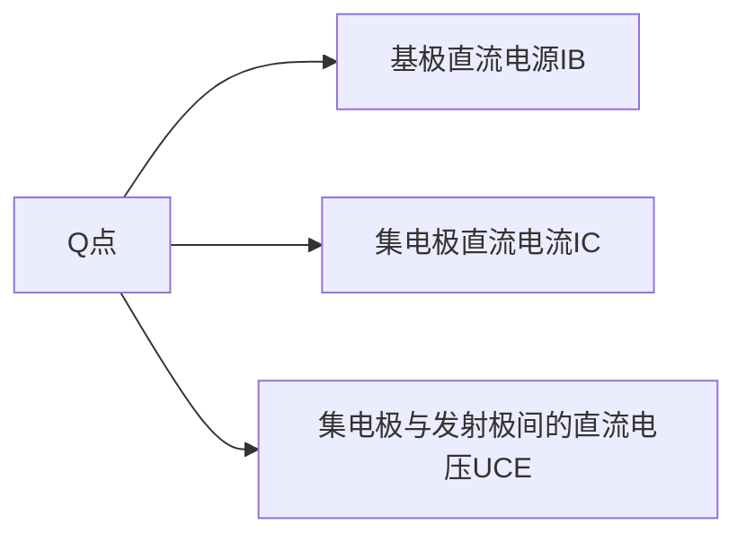
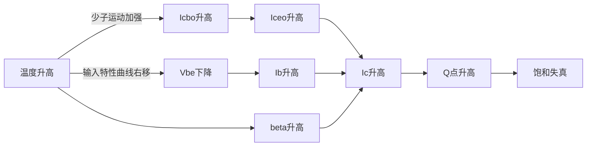

# 第二章 放大电路分析基础

XD Univ. @ 诚夏 SincereXIA

## 放大电路工作原理

> **放大的基本概念** 
>
> 输出电压或电流在幅度上得到了放大， 在能量上得到了加强，能量由直流电源提供

### 放大电路的组成原则

1. **要有直流通路** 保证发射结正偏，集电结反偏，使晶体管工作在放大区
2. **要有交流通路** 待放大的输入信号能加到发射结上，放大了的信号能从电路中取出
3. **确保合适的工作点** 信号始终处于放大区

**放大原理**

## 放大电路的信号及常用符号

1. $u_{BE}$ (小写字母，大写下标）——**瞬时值** ，实际的物理信号

2. $U_{BE}$ (大写字母， 大写下标) ——实际信号的 **直流成分**

3. $u_{be}$ (小写字母， 小写下标) ——实际信号的 **交流成分**

4. $U_{be}$ (大写字母，小写下标) ——交流信号的 **有效值**

5. $U_{bem}$  ——交流信号的 **最大值** 

## 放大电路的直流工作状态

**确定直流工作状态，就是确定 Q 点**

其中：$(I_{B}, U_{BE})$ 在三极管输入曲线上确定Q点， $(I_C,U_{CE})$ 在三极管输出曲线上确定 Q 点

## 放大电路的基本分析方法

### 解析法确定静态工作点

**必须已知三极管的 $\beta$ 值**，静态工作点在直流通路求得，直流通路： **将电容视为开路**

所需要使用的公式

1. $$
   I_{BQ}=\frac{V_{CC}-U_{BEQ}}{R_B}=\frac{V_{CC}-0.7(硅)}{R_B}
   $$

2. $$
   I_{CQ}=\beta I_{BQ}
   $$

3. $$
   U_{CEQ}=V_{CC}-I_{CQ}R_C-I_{BQ}R_B
   $$

### 图解法确定静态工作点

1. 在输入特性曲线上，作出直线 $V_{BE} =V_{CC}－I_BR_B$，两线的交点即是Q点，得到$I_{BQ}$。
2. 在输出特性曲线上，作出直流负载线 $V_{CE}=V_{CC}－I_CR_c$，与IBQ曲线的交点即为Q点，从而得到$V_{CEQ}$ 和$I_{CQ}$。

### 电路参数对静态工作点的影响

1. $R_b$ 增加，$I_{BQ}$ 降低， 工作点沿直流负载线下移
2. $R_c$ 减小，$R_L`$ 减小，斜率绝对值增加，工作点沿$i_{B}=I_{BQ}$ 特性曲线右移 
3. $U_{CC}$ 增加，$I_{BQ}$ 增大，直流负载线平行右上移，工作点向右上方移动

### 放大器的动态范围

失真输出电压的峰峰值：$U_{opp}$。

1. 当$(U_{CEQ}－U_{CES})>(V_{CC}－U_{CEQ})$时，受截止失真限制，$U_{OPP}=2U_{OMAX}=2I_{CQRL’}$。
2. 当$(U_{CEQ}－U_{CES})<(V_{CC}－U_{CEQ})$时，受饱和失真限制，$U_{OPP}=2U_{OMAX}=2(U_{CEQ}－U_{CES})$。
3. 当$(U_{CEQ}－U_{CES})=(V_{CC}－U_{CEQ})$，放大器将有最大的不失真输出电压。 

## 放大电路的动态分析

> **动态分析的对象是交流通路，分析的关键是做交流负载线**

交流通路：电容视为短路，理想直流电压源视为短路（接地）

### 图解法分析动态特性

三极管工作点的移动不再沿直流负载线，而是按交流负载线移动。

### 放大电路的非线性失真

1. Q 点过低，信号进入截止区—— **截止失真**

   

   不发生截止失真的条件： $I_{BQ}>I_{bm}$

   **不管是NPN管还是PNP管，远离横轴处的失真都是截止失真**

   **NPN管**：顶部失真为截止失真

2. Q 点过高， 信号进入饱和区—— **饱和失真**

   

   不发生饱和失真的条件：$I_{BQ}+I_{bm}<I_{BS}$

###  微变等效电路法

   

$$
r_{be}=r_{b}+(1+\beta)r_{e}
$$
$$
r_e=(1+\beta)\frac{V_{T}}{I_{EQ}}=(1+\beta)\frac{26mV}{I_{EQ}} = \frac{26mV}{I_{BQ}}
$$
$$
r_{b}=300\Omega
$$

   ##  三种基本组态放大电路的分析

   1. 放大倍数

      1. 电压放大倍数：

         $$
         A_{U} = \frac{U_o}{U_i}
         $$

      2. 源电压放大倍数：

         $$
         A_{us} = \frac{U_o}{U_s}=\frac{R_i}{R_s+R_i}A_u
         $$

         *考虑了信号源内阻$R_s$影响时的电压放大倍数*

   2. 输入电阻 $R_i$：

      从放大器输入端看进去的电阻

   3. 输出电阻 $R_o$:

      将放大电路等效为戴维南等效电路，这个戴维南等效电路的内阻就是输出电阻

      **确定输出电阻的方法**

      1. 计算法

         1. ==**计算输出电阻时，务必去掉负载！**==
         2. 将所有电源置零（独立源置零，保留受控源）
         3. 加压求流法

      2. 测量法

         1. 测量开路电压

         2. 测量接入负载$R_L$后的输出电压

         3. 计算 $$r_o = (\frac{U_o}{U_o'}-1)R_L$$

   4. 通频带

      $f_{bw} = f_{H}- f_L$

      为了不失真的放大，放大器的通频带必须大于信号的频带

## 微变等效电路模型

### 三种组态的比较

|              | 共发射极                                 | 共集电极                                             | 共基极                                  |
| ------------ | ---------------------------------------- | ---------------------------------------------------- | --------------------------------------- |
| **电压增益** | $A_u=-\beta\frac{R_c}{r_{be}}$ 约-136 | $\frac{(1+\beta)R_e}{r_{be}+(1+\beta)R_e}$ 约 1   | $\beta\frac{Rc}{r_{be}}$ 约 136      |
| **输入电阻** | $R_b//r_{be}$ 约1K                    | $R_b//[r_{be}+(1+\beta)R_e]$ 约154K               | $R_e//\frac{r_{be}}{1+\beta}$ 约21.6 |
| **输出电阻** | $R_c$ 约3K                            | ==$R_e//\frac{r_{be}+(R_s//R_b)}{1+\beta}$== 约80 | $R_c$ 约3K                           |

**共集电极放大电路的特点：**

1. 高输出电阻，低输出电阻
2. 电压增益近似为1
3. 具有电流放大能力

被称为 **电压跟随器** **射极输出器** 

### 静态工作点的稳定及其偏置电路

1. 温度对静态工作点的影响

2. 射极偏置电路

   

   

   **射极偏置电路的工作点稳定过程：**

   $$
   T\uparrow\longrightarrow I_C\uparrow\longrightarrow I_E\uparrow\longrightarrow U_E\uparrow\longrightarrow U_{BE}\downarrow\xrightarrow{由输入特性曲线} I_B\downarrow\longrightarrow I_C\downarrow
   $$

   **电容$C_E$ 的作用**：

   保证放大倍数不受影响

## 多级放大电路

### 耦合方式

阻容耦合、直接耦合、变压器耦合

阻容耦合前后级相对独立，静态工作点互不影响，可以抑制温漂

> **零点漂移：**放大电路在无输入信号的情况下，输出电压uo却出现缓慢、不规则波动的现象。 
>
> 是三极管的工作点随时间而逐渐偏离原有静态值的现象。产生零点漂移的**主要原因是温度**的影响，所以有时也用温度漂移或时间漂移来表示。
>
> 一般将在一定时间内，或一定温度变化范围内的**输出级工作点的变化值除以放大倍数**，即将输出级的漂移值**归算到输入级**来表示的

### 电压放大倍数的计算

1. 直接耦合电路

   1. 输入电阻法：后一级的输入电阻是前一级的负载 *后级是前级的负载*
   2. 开路电压法：将后一级与前一级开路，计算前一级的开路电压放大倍数和输出电阻，将其作为信号源一级内阻考虑，共同作用到后一级 *前级是后级的信号源*

2. **阻容耦合放大电路**

   1. 静态分析：各级单独计算 **静态工作点独立**

   2. 动态分析：

      1. 电压放大倍数等于各级电压放大倍数的乘积

         **计算前级的电压放大倍数时，必须把后级的输入电阻考虑到前级的负载电阻之中**

      2. 输入电阻就是第一级的输入电阻

      3. 输出电阻就是最后一级的输出电阻