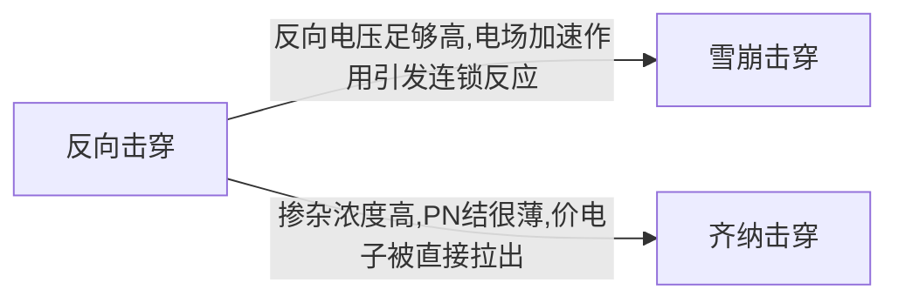
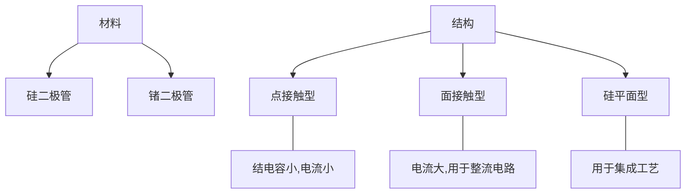
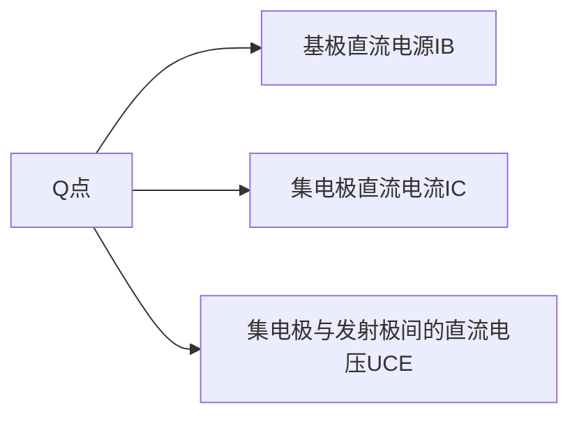
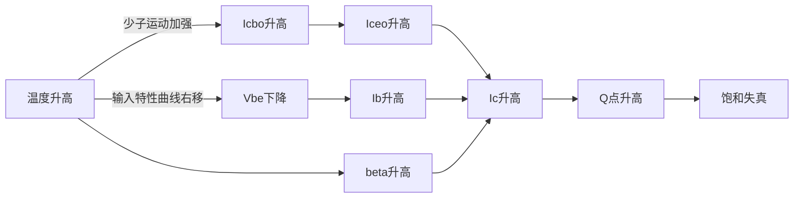

# 第一章 半导体器件

XD Univ. @ 诚夏 SincereXIA

## 1.1.1 本征半导体

1. *本征半导体是纯净的半导体材料*, 如 " 硅 " , "锗"， 具有4价共价键晶体结构

2. 特点:

   **光敏、热敏、掺杂特性**

   1. 受热, 光作用, 导电能力显著变化
   2. 掺入杂质之后,导电能力显著变化.
   3. 本征半导体中的自由电子很少,导电能力很弱.

3. **本征激发**:

   ```mermaid
   graph LR;
   价电子-->本征激发
   本征激发-->自由电子;
   本征激发-->空穴;
   自由电子--载流子---空穴;
   自由电子---重新结合((重新结合));
   空穴---重新结合;
   重新结合---复合;
   自由电子---定向运动((电场下定向运动));
   空穴---定向运动;
   定向运动---漂移;
   本征激发--动态平衡---复合;
   ```

## 1.1.2 杂质半导体

**杂质半导体是掺入微量三价或五价元素的半导体**

1. N型半导体: *电子型半导体*

   掺入五价元素, 自由电子是多子

2. P 型半导体: *空穴型半导体*

   掺入三价元素, 空穴是多子

3. 载流子的运动

   漂移运动:**载流子在电场的作用下运动**

   扩散运动:**载流子受到浓度差的影响运动**

## 1.2 PN 结

1. PN结的形成:

   ```mermaid
   graph LR;
   多子的扩散-->空间电荷区,内电场;
   空间电荷区,内电场-->1(促进少子漂移,阻碍多子扩散)
   1-->达到动态平衡;
   达到动态平衡-->PN结;
   PN结---对称结;
   PN结---不对称结;
   不对称结---P+N
   不对称结---PN+
   ```

   **简答题： PN结的形成原理**

   电子从 N区 扩散到 P区, 空穴从 P区 扩散到 N区.

   扩散后, N区 带正电, P区 带负电, 形成一个从 N 区到 P 区的**内电场**, 该内电场促进少子的漂移,阻碍多子的扩散,和扩散作用方向相反, 最终达到动态平衡.  **这时空间电荷区不再变化**，这个空间电荷区，**就是PN结**

   空间电荷区无载流子停留，又称作 **耗尽层、阻挡层、势垒层**

2. 实际中，如果一边掺杂大，一边掺杂浓度小，则称为 **不对称** 结，+号表示重掺杂区，**耗尽区主要伸向轻掺杂一边**

> **空间电荷区特点：**
>
> 1. 无载流子
> 2. 阻止多子扩散
> 3. 利于少子漂移

### 1.2.2 PN结的单向导电性

**正向导通** $P\rightarrow N$ 低阻性

**反向截止** $P\nleftarrow N$ 高阻性

**简答题：PN结单向导电性的原理**

**外加正向电压时**，P 区 电动势高于 N 区电动势, 削弱了内电场, **使得阻挡层变窄**, 多子扩散作用增强, 形成正向电流. 由于 **多子浓度大**， **因此，正向电流较大；** **外加反向电压时**, 阻挡层内形成的电场与内电场方向相同, 增强了内电场, **使得阻挡层变宽**, 少子的漂移作用增强, 形成反向电流, **由于少子数量少, 形成反向饱和电流, $I_D = - I_S$**

### PN 结的伏安特性


$$I_D = I_S ( e^{u/U_T} - 1)$$

> $I_s$: 反向饱和电流
>
> $u$: 结电压
>
> $U_T$: 温度的电压当量, *室温下, $U_T = 26mV$* 

当 $U<U_B$ 时, 发生反向击穿



### 1.2.5 PN结的电容效应

**势垒电容: ** $C_T$ , 由阻挡层内空间电荷引起  *(反偏时起主要作用)*

**扩散电容: ** $C_P$, 由多子扩散后, 在另一侧面积累形成 *(正偏时起主要作用)*

### 1.2.6 半导体二极管

$$PN结 + 引线 + 管壳 = Diode$$

1. 分类:



1. 二极管的伏安特性

   1. 正向特性

      **死区电压** $U_{on}$ : 当正向电压高于死区电压后, 才有明显的正向电流

      硅管的$U_{on}$约为 0.6~0.8 V, 锗管约为 0.1~0.3 V

   2. 反向特性

      **反向饱和电流**: 二极管加反向电压, 电流数值很小. 且基本不变

      **反向击穿**: 反向电流达到一定值时, 反向电流急剧增加, 产生击穿

   3. 温度特性

      二极管的特性对温度很敏感, 温度升高, 正向曲线左移. 反向曲线下移

      > 温度每升高 1 °C，正向压降减小 2~2.5 mV
      >
      > 温度每升高 10 °C，反向电流增大一倍

### 1.3.3 二极管的参数

1. 最大整流电流 : 二极管允许通过的最大正向平均电流
2. 最大反向工作电压: $U_R$
3. 反向电流: $I_R$
4. 最高工作频率: $f_M$
5. 二极管直流电阻: $R_D$
6. 二极管交流电阻: $r_d = \frac{\Delta U}{\Delta I}$
7. 微变电阻: $r_D = \frac{U_T}{I_D} \approx \frac{26 mV}{I_{DG}}$

**对于同一工作点而言, $直流R_D > 交流 r_D$**

### 1.3.4 半导体二极管的等效模型

1. **低频大信号模型**

   1. 理想二极管模型: 理想开关

   2. **理想二极管串联恒压降模型: 理想开关和电源的串联, 电源反接, 电压源大小为 $U_{D(on)}$ , 为通过二极管的电流为 1mA 时的外接电压**

      > 对于硅管，通常取$U_{D(on)}$为0.7，对于锗管，通常取$U_{D(on)}$为0.3

   3. *折线模型: 理想开关和电源和电阻的串联, 电压源大小为 $U_{TH}$ , 为死区电压, 电阻$r_D = \frac{0.7 V - 0.5 V}{1mA} = 200\Omega$* （不要求掌握折线模型）


1. 低频小信号模型

   微变等效电路法， $r_d = \frac{U_T}{I_Q}$

   其中，$U_T$ 为 26mV， $I_Q$ 为静态工作点的电流

   #### 二极管电路的分析方法：

   1. 判断通断题

      **先假设二极管断开**，分析二极管两端电位的高低:

      若 Vp >Vn (正偏)，二极管导通(短路);

      若 Vp <Vn (反偏)，二极管截止(开路)。

   2. 直流图解分析

      在二极管的伏安特性曲线中绘制直线：$U_D=V_{DD}-I_DR$ , 两条曲线的交点就是静态工作点

      

   3. 二极管的微变等效电路分析法

      **步骤：**

      1. **静态分析：** 通过直流图解分析，或等效恒压源模型， **确定静态工作点的电流$I_Q$**
      2. **动态分析：** 使用低频小信号模型$r_d = \frac{U_T}{I_Q}$， 计算微变电阻，**去掉直流源**，计算通过二极管的交流电流
      3. **叠加：**最终的总电压，电流为直流和交流的电压和电流之和

      例题：

      

   #### 特殊的二极管

   1. 稳压二极管

      **常工作在PN结的反向击穿区**，原理：二极管的反向击穿特性

   2. 光敏、热敏二极管

      二极管反接，原理：二极管的光敏热敏特性

## 1.4 半导体三极管


### 1.4.1 三极管的结构及类型

1. 结构：**NPN**、**PNP**

   1. 三区两节
   2. 结构特点：基区最薄，掺杂浓度最低；发射区掺杂浓度最高；集电区面积最大

2. 符号：

   |                             PNP                              |                             NPN                              |
   | :----------------------------------------------------------: | :----------------------------------------------------------: |
   |  |  |

3. **根据各电极对地电位和各电极电流判断管子类型 （重点）**

   硅管（VBE=0.7V）、锗管（ VBE= 0.2V） 

### 1.4.2 三极管的放大原理

> 依靠发射极电流能通过基区传输，然后到达集电极而实现的
>
> 三极管内有两种载流子(自由电子和空穴)参与导电，故称为双极型三极管。或BJT (Bipolar Junction Transistor)。 

1. 三极管放大的条件

   1. 内部条件
      发浓，基薄，集大
   2. 外部条件
      **发射结正偏**、**集电结反偏**

2. 电流分配关系
   $$I_E = I_{CE} + I_{BE}=I_C+I_B$$
   $$I_B = I_{BE}-I_{CBO}\approx I_{BE}$$
   $$I_C=I_{CE}+I_{CBO}\approx I_{CE}$$

   1. 共基极直流电流放大系数：$\alpha$

      扩散到集电区的电流 $I_{CN}$ 与射极注入电流 $I_{EN}$ 的比例关系

      $$\alpha = \frac{I_E传输到集电极的电流分量}{发射极电流I_E}=\frac{I_c-I_{CBO}}{I_E}\approx \frac{I_C}{I_E}$$

   2. 共发射极直流电流放大系数 ：$\beta$

      扩散到集电区的电流 $I_{CN}$ 与基区复合电流 $I_{BN}$ 的比例关系

      $$\beta = \frac{I_{CN}}{I_{BN}} = \frac{I_C-I_{CBO}}{I_B+I_{CBO}} = \frac{\alpha}{1-\alpha}$$

### 三极管的特性曲线

1. 共发射极的输入特性曲线

   > $U_{CE}$ 不变时，输入回路中 $I_B$ 与 $U_{BE}$ 的关系曲线，当$U_{CE} $ 增大时，曲线右移

   

2. 共发射极的输出特性曲线

   > $I_B$不变时，输出回路中的电流$I_C$ 与电压 $U_{CE}$ 之间的关系曲线

   

### 三极管的工作区

| 状态 | $u_{BE}$      | $i_C$         | $u_{CE}$     |
| ---- | ------------- | ------------- | ------------ |
| 截止 | $<U_{on}$     | $I_{CEO}$     | $V_{CC}$     |
| 放大 | $\ge U_{on}$  | $\beta i_B$   | $\ge u_{BE}$ |
| 饱和 | $\ge  U_{on}$ | $< \beta i_B$ | $\le u_{BE}$ |

### 温度对晶体管特性及参数的影响


1. 温度升高，输入特性曲线左移，输出特性曲线上移，输出特性曲线间距增大
2. 温度升高，$I_{CBO}$ 、$I_{CEO}$、$I_{C}$、$\beta$ 均增大


# 第二章 放大电路分析基础

XD Univ. @ 诚夏 SincereXIA

## 放大电路工作原理

> **放大的基本概念** 
>
> 输出电压或电流在幅度上得到了放大， 在能量上得到了加强，能量由直流电源提供

### 放大电路的组成原则

1. **要有直流通路** 保证发射结正偏，集电结反偏，使晶体管工作在放大区
2. **要有交流通路** 待放大的输入信号能加到发射结上，放大了的信号能从电路中取出
3. **确保合适的工作点** 信号始终处于放大区

**放大原理**


## 放大电路的信号及常用符号

1. $u_{BE}$ (小写字母，大写下标）——**瞬时值** ，实际的物理信号
2. $U_{BE}$ (大写字母， 大写下标) ——实际信号的 **直流成分**
3. $u_{be}$ (小写字母， 小写下标) ——实际信号的 **交流成分**
4. $U_{be}$ (大写字母，小写下标) ——交流信号的 **有效值**
5. $U_{bem}$  ——交流信号的 **最大值** 

## 放大电路的直流工作状态

**确定直流工作状态，就是确定 Q 点**



其中：$(I_{B}, U_{BE})$ 在三极管输入曲线上确定Q点， $(I_C,U_{CE})$ 在三极管输出曲线上确定 Q 点

## 放大电路的基本分析方法

### 解析法确定静态工作点

**必须已知三极管的 $\beta$ 值**，静态工作点在直流通路求得，直流通路： **将电容视为开路**

所需要使用的公式

1. $$
   I_{BQ}=\frac{V_{CC}-U_{BEQ}}{R_B}=\frac{V_{CC}-0.7(硅)}{R_B}
   $$

2. $$
   I_{CQ}=\beta I_{BQ}
   $$

3. $$
   U_{CEQ}=V_{CC}-I_{CQ}R_C-I_{BQ}R_B
   $$


### 图解法确定静态工作点

1. 在输入特性曲线上，作出直线 $V_{BE} =V_{CC}－I_BR_B$，两线的交点即是Q点，得到$I_{BQ}$。
2. 在输出特性曲线上，作出直流负载线 $V_{CE}=V_{CC}－I_CR_c$，与IBQ曲线的交点即为Q点，从而得到$V_{CEQ}$ 和$I_{CQ}$。

### 电路参数对静态工作点的影响


1. $R_b$ 增加，$I_{BQ}$ 降低， 工作点沿直流负载线下移
2. $R_c$ 减小，$R_L`$ 减小，斜率绝对值增加，工作点沿$i_{B}=I_{BQ}$ 特性曲线右移 
3. $U_{CC}$ 增加，$I_{BQ}$ 增大，直流负载线平行右上移，工作点向右上方移动

### 放大器的动态范围

失真输出电压的峰峰值：$U_{opp}$。

1. 当$(U_{CEQ}－U_{CES})>(V_{CC}－U_{CEQ})$时，受截止失真限制，$U_{OPP}=2U_{OMAX}=2I_{CQRL’}$。
2. 当$(U_{CEQ}－U_{CES})<(V_{CC}－U_{CEQ})$时，受饱和失真限制，$U_{OPP}=2U_{OMAX}=2(U_{CEQ}－U_{CES})$。
3. 当$(U_{CEQ}－U_{CES})=(V_{CC}－U_{CEQ})$，放大器将有最大的不失真输出电压。 

## 放大电路的动态分析

> **动态分析的对象是交流通路，分析的关键是做交流负载线**

交流通路：电容视为短路，理想直流电压源视为短路（接地）

### 图解法分析动态特性

三极管工作点的移动不再沿直流负载线，而是按交流负载线移动。

### 放大电路的非线性失真

1. Q 点过低，信号进入截止区—— **截止失真**

   

   不发生截止失真的条件： $I_{BQ}>I_{bm}$

   **不管是NPN管还是PNP管，远离横轴处的失真都是截止失真**

   **NPN管**：顶部失真为截止失真

2. Q 点过高， 信号进入饱和区—— **饱和失真**

   

   不发生饱和失真的条件：$I_{BQ}+I_{bm}<I_{BS}$

### 微变等效电路法

   
$$
r_{be}=r_{b}+(1+\beta)r_{e}
$$

$$
r_e=(1+\beta)\frac{V_{T}}{I_{EQ}}=(1+\beta)\frac{26mV}{I_{EQ}} = \frac{26mV}{I_{BQ}}
$$

$$
r_{b}=300\Omega
$$

## 三种基本组态放大电路的分析

1. 放大倍数

   1. 电压放大倍数：
      $$
      A_{U} = \frac{U_o}{U_i}
      $$

   2. 源电压放大倍数：
      $$
      A_{us} = \frac{U_o}{U_s}=\frac{R_i}{R_s+R_i}A_u
      $$
      *考虑了信号源内阻$R_s$影响时的电压放大倍数*

2. 输入电阻 $R_i$：

   从放大器输入端看进去的电阻

3. 输出电阻 $R_o$:

   将放大电路等效为戴维南等效电路，这个戴维南等效电路的内阻就是输出电阻

   **确定输出电阻的方法**

   1. 计算法
      1. ==**计算输出电阻时，务必去掉负载！**==
      2. 将所有电源置零（独立源置零，保留受控源）
      3. 加压求流法
   2. 测量法
      1. 测量开路电压
      2. 测量接入负载$R_L$后的输出电压
      3. 计算 $$r_o = (\frac{U_o}{U_o'}-1)R_L$$

4. 通频带

   $f_{bw} = f_{H}- f_L$

   为了不失真的放大，放大器的通频带必须大于信号的频带

## 微变等效电路模型

### 三种组态的比较


|              | 共发射极                                 | 共集电极                                             | 共基极                                  |
| ------------ | ---------------------------------------- | ---------------------------------------------------- | --------------------------------------- |
| **电压增益** | $A_u=-\beta\frac{R_c}{r_{be}}$<br>约-136 | $\frac{(1+\beta)R_e}{r_{be}+(1+\beta)R_e}$<br>约 1   | $\beta\frac{Rc}{r_{be}}$<br>约 136      |
| **输入电阻** | $R_b//r_{be}$<br>约1K                    | $R_b//[r_{be}+(1+\beta)R_e]$<br>约154K               | $R_e//\frac{r_{be}}{1+\beta}$<br>约21.6 |
| **输出电阻** | $R_c$<br>约3K                            | ==$R_e//\frac{r_{be}+(R_s//R_b)}{1+\beta}$==<br>约80 | $R_c$<br>约3K                           |

**共集电极放大电路的特点：**

1. 高输出电阻，低输出电阻
2. 电压增益近似为1
3. 具有电流放大能力

被称为 **电压跟随器** **射极输出器** 

### 静态工作点的稳定及其偏置电路

1. 温度对静态工作点的影响



1. 射极偏置电路

   

   

   **射极偏置电路的工作点稳定过程：**
   $$
   T\uparrow\longrightarrow I_C\uparrow\longrightarrow I_E\uparrow\longrightarrow U_E\uparrow\longrightarrow U_{BE}\downarrow\xrightarrow{由输入特性曲线} I_B\downarrow\longrightarrow I_C\downarrow
   $$
   **电容$C_E$ 的作用**：

   保证放大倍数不受影响

## 多级放大电路

### 耦合方式

阻容耦合、直接耦合、变压器耦合

阻容耦合前后级相对独立，静态工作点互不影响，可以抑制温漂

> **零点漂移：**放大电路在无输入信号的情况下，输出电压uo却出现缓慢、不规则波动的现象。 
>
> 是三极管的工作点随时间而逐渐偏离原有静态值的现象。产生零点漂移的**主要原因是温度**的影响，所以有时也用温度漂移或时间漂移来表示。
>
> 一般将在一定时间内，或一定温度变化范围内的**输出级工作点的变化值除以放大倍数**，即将输出级的漂移值**归算到输入级**来表示的

### 电压放大倍数的计算

1. 直接耦合电路

   1. 输入电阻法：后一级的输入电阻是前一级的负载 *后级是前级的负载*
   2. 开路电压法：将后一级与前一级开路，计算前一级的开路电压放大倍数和输出电阻，将其作为信号源一级内阻考虑，共同作用到后一级 *前级是后级的信号源*

2. **阻容耦合放大电路**

   1. 静态分析：各级单独计算 **静态工作点独立**

   2. 动态分析：

      1. 电压放大倍数等于各级电压放大倍数的乘积

         **计算前级的电压放大倍数时，必须把后级的输入电阻考虑到前级的负载电阻之中**

      2. 输入电阻就是第一级的输入电阻

      3. 输出电阻就是最后一级的输出电阻


# 场效应管放大电路


## 场效应晶体管 （FET）

1. 特点

   - **是一种电压控制器件** ：有极高的输入电阻，工作时，管子的输入电流几乎为 0。
   - **输出电流仅由多子运动而形成** 故称 **单极** 型器件，其抗温度和抗辐射能力强，工作稳定
   - **制造工艺简单** 便于大规模集成，噪声小
   - 结构对称，类型多，有时漏极和源极可以互换使用，使得电路设计灵活性增大
   - 输入电阻极高，外界静电感应产生的电荷可能会引起绝缘层击穿
   - **跨导小**，在相同的负载电阻下，电压放大倍数比双极型三极管低

2. 分类

   > 根据结构的不同，场效应管可分为两大类：**结型场效应管 (JFET) **和**金属 -氧化物 -半导体场效应管 (MOSFET)**。

   ```mermaid
   graph LR;
   FET(FET场效应管)---JFET(JFET结型)
   FET---MOSFET(MOSFET绝缘栅型)
   JFET---N沟道
   JFET---P沟道
   MOSFET---增强型
   MOSFET---耗尽型
   ```

## 结型场效应管

### 结构：

**三级：** 栅极（Gate）、源极（Source）（电子发射端）、漏极（Drain）（电子接收端）

**两区：** N 型 / P 型 半导体衬底、高掺杂区

| N 沟道 JFET                                                  | 符号                                                         | P 沟道 JFET                                                  | 符号                                                         |
| ------------------------------------------------------------ | ------------------------------------------------------------ | ------------------------------------------------------------ | ------------------------------------------------------------ |
|  |  |  |  |

> N 沟道和P 沟道结型场效应管符号上的区别，在于**栅极的箭头方向不同**，但都要**由P区指向N区**

### 工作原理

在漏极、源极之间加一定的正电压，使沟道中的多子漂移，形成$i_D$

在栅极、源极之间加 **负电压** ，栅极与沟道之间的 PN 结 **反偏**

1. $V_{GS}$ 对沟道的控制作用

   **PN 结反偏，使耗尽层加厚，导电沟道变窄，直到沟道被耗尽层完全夹断**

   

   导电沟道夹断后，$I_D=0$ ，此时的栅源电压 $V_{cs}$ 称为 **夹断电压 $V_p$**

2. 漏源电压 $V_{DS}$ 对 $i_D$ 的影响

   在栅源电压到达 $V_p$ 前，**靠近漏极处**会先达到 **预夹断** 状态，当 $V_{DS}$继续增加时，预夹断点向源极方向伸长为预夹断区。由于预夹断区电阻很大，使主要 $V_{DS}$降落在该区，由此产生的强电场力能把未夹断区漂移到其边界上的载流子都扫至漏极，形成**漏极饱和电流**。 

   

   预夹断前， $U_{DS}\uparrow\longrightarrow I_D \uparrow$

   预夹断后， $U_{DS}\uparrow\longrightarrow I_D几乎不变$

   在预夹断处：栅极和漏极之间的电压等于夹断电压
   $$
   V_{GD}=V_{GS}-V_{DS} =V_P
   $$


### 特性曲线

1. 输出特性曲线

   > 输出特性曲线（也叫漏极特性）是指在栅源电压UGS一定时，漏极电流ID与漏源电压UDS之间关系

   

   场效应管的工作状态可分为：**可变电阻区、恒流区、击穿区** 三个区域

   - 可变电阻区

     - **条件：** 源端与漏端均不夹断

     - **特点： ** 当 $v_{GS}$ 为定值时,$i_D$ 是 $v_{DS}$ 的线性函数，管子的漏源间呈现为线性电阻。  

       **当 $U_{GS}$ 增大，相应的电阻增大** （有效沟道变窄）

   - 恒流区 （饱和区、放大区）

     - **条件：**源端未夹断，漏端夹断

     - **特点：**

       - 恒流性：输出电流$i_D$ 基本上不受输出电压$v_{DS}$的影响。

       - 受控性：栅源电压控制输出电流
         $$
         i_D=I_{DSS}(1-\frac{v_{GS}}{V_p})^2
         $$
         其中 $I_{DSS}$ : 饱和漏源电流。栅极电压 $U_{GS}=0$ 时的漏源电流

         $V_p$：夹断电压 

   - 夹断区

     - **条件：** 整个沟道都被夹断，漏源电压大于夹断电压

   - 击穿区

     - **条件：** 漏源电压增大到 $V_{DS} = V_{(BR)DS}$ 漏端 PN 结发生雪崩击穿

2. 转移特性曲线

   > 当漏、源之间电压$U_{DS}$保持不变时，漏极电流$I_D$和栅、源之间电压 $U_{GS}$ 的关系称为转移特性。即它描述了栅、源之间的电压 $U_{GS}$ 对漏极电流 $I_D$ 的控制作用。

   

   **图中两点：**

   - $U_{GS}=0$ 时，$I_D = I_{DSS}$ 称为饱和漏极电流
   - $I_D=0$ 时，$U_P$ 称为夹断电压

   转移特性曲线的斜率 $g_m$ 的大小反映了**栅源电压对漏极电流的控制作用**。 其量纲为mA/V，称$g_m$为**跨导**。
   $$
   gm=\Delta I_D/\Delta V_{GS}\big|_Q (mS)
   $$
   

   

## 绝缘栅型场效应管 （MOSFET）

### 结构：

在P型半导体上生成一层 $SiO_2$ 薄膜绝缘层，然后用光刻工艺扩散两个高掺杂的 N 型区，从N型区引出电极，一个是漏极 D，一个是源极 S。 在源极和漏极之间的绝缘层上镀一层金属铝作为栅极G。P型半导体称为衬底，用符号B表示。

- 沟道增强型

  $SiO_2$ 绝缘薄层内无金属离子，栅源电压为 0 时，漏源之间无导电沟道

- 沟道耗尽型

  $SiO_2$ 绝缘薄层内有金属离子，栅源电压为 0 时，漏源之间有导电沟道

|            |                                                              | **N 沟道**                                                   | **P沟道**                                                    |
| ---------- | ------------------------------------------------------------ | ------------------------------------------------------------ | ------------------------------------------------------------ |
| **增强型** |  |  |  |
| **耗尽型** |  |  |  |

### 工作原理：

- 沟道增强型：
  - 当 $V_{GS}=0 V$ 时，因为漏源之间被两个背靠背的 PN结隔离，因此，即使在D、S之间加上电压, 在D、S间也不可能形成电流。 
  - 当 $0<V_{GS}<V_T(开启电压)$ 时，栅极和衬底间的电容作用，将栅极下方P型衬底表层的空穴向下排斥，同时，使两个N区和衬底中的自由电子吸向衬底表层，并与空穴复合而消失， 衬底表面形成一薄层负离子的耗尽层。漏源间仍无载流子的通道。**管子仍不能导通，处于截止状态。** 
  - 当 $V_{GS}>V_T$ 时，衬底表层中的自由电子数量大于空穴数量，该**薄层转换为N型半导体，称此为反型层。**形成 N 源区 到 N 漏区 的 N 型沟道。 **把开始形成反型层的 $V_{GS}$ 值称为该管的开启电压 $V_T$**。这时，若在漏源间加电压 $V_{DS}$，就能产生漏极电流 $I_D$，管子开启。 $V_{GS}$ 值越大，沟道内自由电子越多，沟道电阻越小，在同样 $V_{DS}$ 电压作用下，$ I_D$  越大。这样，就实现了输入电压 $ V_{GS} $ 对输出电流 $I_D $的控制。 
- 沟道耗尽型
  - 预先在SiO2绝缘层中掺入大量的正离子，因此，在UGS=0时，这些**正离子产生的电场也能在P型衬底中“感应”出足够的电子**，形成N型导电沟道。 耗尽型 MOS 管存在原始导电沟道。因此，使用时无须加开启电压 （$V_{GS}=0$），只要加漏源电压，就会有漏极电流。 
  - 当$U_{GS}=0$时，$U_{DS}$ 加正向电压，产生漏极电流$I_D$，此时的漏极电流称为漏极饱和电流，用$I_{DSS}$表示
  - 当$U_{GS}＞0$时，将使$I_D$进一步增加。
  - 当$U_{GS}＜0$时，随着$U_{GS}$的减小漏极电流逐渐减小。直至$I_D=0$。对应ID=0的 $U_{GS}$ 称为夹断电压，用符号$U_P$表示。

### 特性曲线：

1. 沟道增强型

   |              | 输出特性曲线                                                 | 转移特性曲线                                                 |
   | ------------ | ------------------------------------------------------------ | ------------------------------------------------------------ |
   | N 沟道增强型 |  |  |
   | P 沟道增强型 |  |  |

2. 绝缘栅型

    

   |              | 输出特性曲线                                                 | 转移特性曲线                                                 |
   | ------------ | ------------------------------------------------------------ | ------------------------------------------------------------ |
   | N 沟道绝缘栅 |  |  |
   | P 沟道绝缘栅 |  |  |

## 总结

|            | N 沟道                                                       | P 沟道                                                       | 转移特性曲线                                                 | 输出特性曲线                                                 |
| ---------- | ------------------------------------------------------------ | ------------------------------------------------------------ | ------------------------------------------------------------ | ------------------------------------------------------------ |
| 沟道增强型 |  |  |  |  |
| 沟道耗尽型 |  |  |  |  |
| 结型       |  |  |  |  |

## 场效应三极管的参数

- 开启电压 $U_{GS}$ (增强型)

  夹断电压 $U_{GS(off)}$ (耗尽型、结型)

- 饱和漏极电流 $I_{DSS}$ : 耗尽型、结型， $U_{GS} = 0$ 时所对应的漏极电流

  

- 直流输入电阻 $R_{GS}$

  漏源间短路时，栅源间加反向电压所呈现的直流电阻

- 低频跨导 $g_m$
  $$
  g_m=\frac{\Delta i_D}{\Delta u_{GS}} \Bigg|_{U_{DS} = 常数} (mS)
  $$
  反映了 $u_{GS}$ 对$i_D$ 的控制能力，单位为 S （西门子）。一般为几毫西

- 漏源击穿电压 $BU_{DS}$ ：使 $I_D$ 开始剧增时的 $U_{DS}$

- 栅源击穿电压 $BU_{GS}$：

  - JFET：反向饱和电流剧增时的栅源电压
  - MOS：使 $SiO_2$ 绝缘层击穿的电压

- 漏极最大允许耗散功率 $P_{Dm}$
  $$
  P_{Dm} = I_DU_{DS}
  $$

- 极间电容

## 场效应管放大电路

### 工作组态

- 共源组态
- 共漏组态
- 共栅组态

### 静态工作点：Q点

> 确定 Q 点的电路要素：$U_{GS}$ 、$U_{DS}$ 、$I_{D}$

- 直流**偏置电路**

  - 自给偏压

    > 直流偏压是靠源极电阻 $R_S$ 上的压降引起

    

    **Q 点确定方程：**
    $$
    \begin{aligned} 
    V_{GS} &= -I_DR\\
    V_{DS} &= V_{DD}-I_D(R_d+R)\\
    I_D &= I_{DSS}(1-\frac{V_{GS}}{V_p})
    \end{aligned}
    $$

  - 分压式自偏压

    > 电源电压经过 $R_{G1}$、$R_{G2}$ 分压后，经 $R_{G3}$ 提供栅压，同时，$I_D$ 在 $R_S$ 上也产生直流压降

    

    **Q 点确定方程：**
    $$
    \begin{aligned} 
    V_{GS} &=\frac{R_{g2}}{R_{g1}+R_{g2}}V_{DD} -I_DR\\
    V_{DS} &= V_{DD}-I_D(R_d+R)\\
    I_D &= I_{DSS}(1-\frac{V_{GS}}{V_p})
    \end{aligned}
    $$

- 直流偏置电路的图解法

  1. 在 **输出特性曲线** 上 **作直流负载线**

     直流负载线方程：
     $$
     U_{DS} = U_{DD} - I_D(R_D+R_S)
     $$

  2. 在 $i_D\sim u_{GS}$ 坐标系中作负载转移特性曲线 $i_D=f(u_{GS})$

  3. 做出源极负载线 $u_{GS} = -i_DR_S$

  

### 微变等效电路

场效应管的微变等效模型：
$$
i_d = g_mu_{gs}+\frac{1}{r_{DS}}u_{ds}
$$
其中：$g_m$ 为低频跨导，$r_{ds}$ 为漏极电阻，可视为断路


