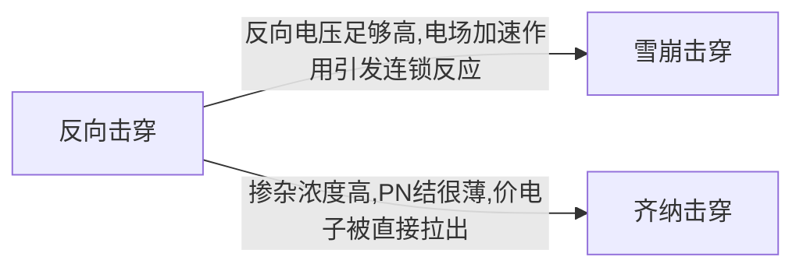
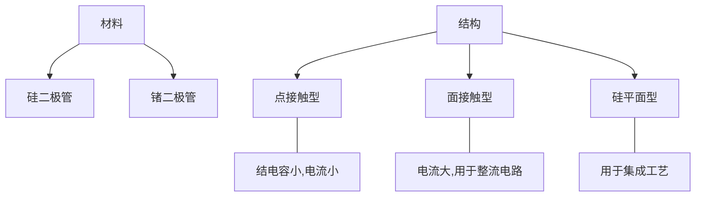

# 第一章 半导体器件

XD Univ. @ 诚夏 SincereXIA

## 1.1.1 本征半导体

1. *本征半导体是纯净的半导体材料*, 如 " 硅 " , "锗"， 具有4价共价键晶体结构

2. 特点:

   **光敏、热敏、掺杂特性**

   1. 受热, 光作用, 导电能力显著变化
   2. 掺入杂质之后,导电能力显著变化.
   3. 本征半导体中的自由电子很少,导电能力很弱.

3. **本征激发**:

   ```mermaid
   graph LR;
   价电子-->本征激发
   本征激发-->自由电子;
   本征激发-->空穴;
   自由电子--载流子---空穴;
   自由电子---重新结合((重新结合));
   空穴---重新结合;
   重新结合---复合;
   自由电子---定向运动((电场下定向运动));
   空穴---定向运动;
   定向运动---漂移;
   本征激发--动态平衡---复合;
   ```

## 1.1.2 杂质半导体

**杂质半导体是掺入微量三价或五价元素的半导体**

1. N型半导体: *电子型半导体*

   掺入五价元素, 自由电子是多子

2. P 型半导体: *空穴型半导体*

   掺入三价元素, 空穴是多子

3. 载流子的运动

   漂移运动:**载流子在电场的作用下运动**

   扩散运动:**载流子受到浓度差的影响运动**


## 1.2 PN 结

1. PN结的形成:

   ```mermaid
   graph LR;
   多子的扩散-->空间电荷区,内电场;
   空间电荷区,内电场-->1(促进少子漂移,阻碍多子扩散)
   1-->达到动态平衡;
   达到动态平衡-->PN结;
   PN结---对称结;
   PN结---不对称结;
   不对称结---P+N
   不对称结---PN+
   ```
   **简答题： PN结的形成原理**

   电子从 N区 扩散到 P区, 空穴从 P区 扩散到 N区.

   扩散后, N区 带正电, P区 带负电, 形成一个从 N 区到 P 区的**内电场**, 该内电场促进少子的漂移,阻碍多子的扩散,和扩散作用方向相反, 最终达到动态平衡.  **这时空间电荷区不再变化**，这个空间电荷区，**就是PN结**

   空间电荷区无载流子停留，又称作 **耗尽层、阻挡层、势垒层**

2. 实际中，如果一边掺杂大，一边掺杂浓度小，则称为 **不对称** 结，+号表示重掺杂区，**耗尽区主要伸向轻掺杂一边**


> **空间电荷区特点：**
>
> 1. 无载流子
> 2. 阻止多子扩散
> 3. 利于少子漂移


### 1.2.2 PN结的单向导电性

**正向导通** $P\rightarrow N$ 低阻性

**反向截止** $P\nleftarrow N$ 高阻性

**简答题：PN结单向导电性的原理**

**外加正向电压时**，P 区 电动势高于 N 区电动势, 削弱了内电场, **使得阻挡层变窄**, 多子扩散作用增强, 形成正向电流. 由于 **多子浓度大**， **因此，正向电流较大；** **外加反向电压时**, 阻挡层内形成的电场与内电场方向相同, 增强了内电场, **使得阻挡层变宽**, 少子的漂移作用增强, 形成反向电流, **由于少子数量少, 形成反向饱和电流, $I_D = - I_S$**

### PN 结的伏安特性


$$I_D = I_S ( e^{u/U_T} - 1)$$

>$I_s$: 反向饱和电流
>
>$u$: 结电压
>
>$U_T$: 温度的电压当量, *室温下, $U_T = 26mV$* 

当 $U<U_B$ 时, 发生反向击穿



### 1.2.5 PN结的电容效应

**势垒电容: ** $C_T$ , 由阻挡层内空间电荷引起  *(反偏时起主要作用)*

**扩散电容: ** $C_P$, 由多子扩散后, 在另一侧面积累形成 *(正偏时起主要作用)*

### 1.2.6 半导体二极管

$$PN结 + 引线 + 管壳 = Diode$$

1. 分类:



2. 二极管的伏安特性

   1. 正向特性

      **死区电压** $U_{on}$ : 当正向电压高于死区电压后, 才有明显的正向电流

      硅管的$U_{on}$约为 0.6~0.8 V, 锗管约为 0.1~0.3 V

   2. 反向特性

      **反向饱和电流**: 二极管加反向电压, 电流数值很小. 且基本不变

      **反向击穿**: 反向电流达到一定值时, 反向电流急剧增加, 产生击穿

   3. 温度特性

      二极管的特性对温度很敏感, 温度升高, 正向曲线左移. 反向曲线下移

      > 温度每升高 1 °C，正向压降减小 2~2.5 mV
      >
      > 温度每升高 10 °C，反向电流增大一倍

### 1.3.3 二极管的参数

1. 最大整流电流 : 二极管允许通过的最大正向平均电流
2. 最大反向工作电压: $U_R$
3. 反向电流: $I_R$
4. 最高工作频率: $f_M$
5. 二极管直流电阻: $R_D$
6. 二极管交流电阻: $r_d = \frac{\Delta U}{\Delta I}$
7. 微变电阻: $r_D = \frac{U_T}{I_D} \approx \frac{26 mV}{I_{DG}}$

**对于同一工作点而言, $直流R_D > 交流 r_D$**

### 1.3.4 半导体二极管的等效模型

1. **低频大信号模型**
   1. 理想二极管模型: 理想开关

   2. **理想二极管串联恒压降模型: 理想开关和电源的串联, 电源反接, 电压源大小为 $U_{D(on)}$ , 为通过二极管的电流为 1mA 时的外接电压**

      > 对于硅管，通常取$U_{D(on)}$为0.7，对于锗管，通常取$U_{D(on)}$为0.3

   3. *折线模型: 理想开关和电源和电阻的串联, 电压源大小为 $U_{TH}$ , 为死区电压, 电阻$r_D = \frac{0.7 V - 0.5 V}{1mA} = 200\Omega$* （不要求掌握折线模型）


2. 低频小信号模型

   微变等效电路法， $r_d = \frac{U_T}{I_Q}$

   其中，$U_T$ 为 26mV， $I_Q$ 为静态工作点的电流

   #### 二极管电路的分析方法：

   1. 判断通断题

      **先假设二极管断开**，分析二极管两端电位的高低:

      若 Vp >Vn (正偏)，二极管导通(短路);

      若 Vp <Vn (反偏)，二极管截止(开路)。

   2. 直流图解分析

      在二极管的伏安特性曲线中绘制直线：$U_D=V_{DD}-I_DR$ , 两条曲线的交点就是静态工作点

      

   3. 二极管的微变等效电路分析法

      **步骤：**

      1. **静态分析：** 通过直流图解分析，或等效恒压源模型， **确定静态工作点的电流$I_Q$**
      2. **动态分析：** 使用低频小信号模型$r_d = \frac{U_T}{I_Q}$， 计算微变电阻，**去掉直流源**，计算通过二极管的交流电流
      3. **叠加：**最终的总电压，电流为直流和交流的电压和电流之和

      例题：

      

   #### 特殊的二极管

   1. 稳压二极管

      **常工作在PN结的反向击穿区**，原理：二极管的反向击穿特性

   2. 光敏、热敏二极管

      二极管反接，原理：二极管的光敏热敏特性

## 1.4 半导体三极管


### 1.4.1 三极管的结构及类型
1. 结构：**NPN**、**PNP**
      1. 三区两节
      2. 结构特点：基区最薄，掺杂浓度最低；发射区掺杂浓度最高；集电区面积最大

2. 符号：

  |                             PNP                              |                             NPN                              |
  | :----------------------------------------------------------: | :----------------------------------------------------------: |
  |  |  |

3. **根据各电极对地电位和各电极电流判断管子类型 （重点）**

      硅管（VBE=0.7V）、锗管（ VBE= 0.2V） 
### 1.4.2 三极管的放大原理

> 依靠发射极电流能通过基区传输，然后到达集电极而实现的
>
> 三极管内有两种载流子(自由电子和空穴)参与导电，故称为双极型三极管。或BJT (Bipolar Junction Transistor)。 
1. 三极管放大的条件
  1. 内部条件
      发浓，基薄，集大
  2. 外部条件
      **发射结正偏**、**集电结反偏**

2. 电流分配关系
  $$I_E = I_{CE} + I_{BE}=I_C+I_B$$
  $$I_B = I_{BE}-I_{CBO}\approx I_{BE}$$
  $$I_C=I_{CE}+I_{CBO}\approx I_{CE}$$

  1. 共基极直流电流放大系数：$\alpha$

     扩散到集电区的电流 $I_{CN}$ 与射极注入电流 $I_{EN}$ 的比例关系

     $$\alpha = \frac{I_E传输到集电极的电流分量}{发射极电流I_E}=\frac{I_c-I_{CBO}}{I_E}\approx \frac{I_C}{I_E}$$

  2. 共发射极直流电流放大系数 ：$\beta$

     扩散到集电区的电流 $I_{CN}$ 与基区复合电流 $I_{BN}$ 的比例关系

     $$\beta = \frac{I_{CN}}{I_{BN}} = \frac{I_C-I_{CBO}}{I_B+I_{CBO}} = \frac{\alpha}{1-\alpha}$$

### 三极管的特性曲线

1. 共发射极的输入特性曲线

   > $U_{CE}$ 不变时，输入回路中 $I_B$ 与 $U_{BE}$ 的关系曲线，当$U_{CE} $ 增大时，曲线右移

   

2. 共发射极的输出特性曲线

   > $I_B$不变时，输出回路中的电流$I_C$ 与电压 $U_{CE}$ 之间的关系曲线

   

### 三极管的工作区

| 状态 | $u_{BE}$      | $i_C$         | $u_{CE}$     |
| ---- | ------------- | ------------- | ------------ |
| 截止 | $<U_{on}$     | $I_{CEO}$     | $V_{CC}$     |
| 放大 | $\ge U_{on}$  | $\beta i_B$   | $\ge u_{BE}$ |
| 饱和 | $\ge  U_{on}$ | $< \beta i_B$ | $\le u_{BE}$ |

### 温度对晶体管特性及参数的影响


1. 温度升高，输入特性曲线左移，输出特性曲线上移，输出特性曲线间距增大
2. 温度升高，$I_{CBO}$ 、$I_{CEO}$、$I_{C}$、$\beta$ 均增大