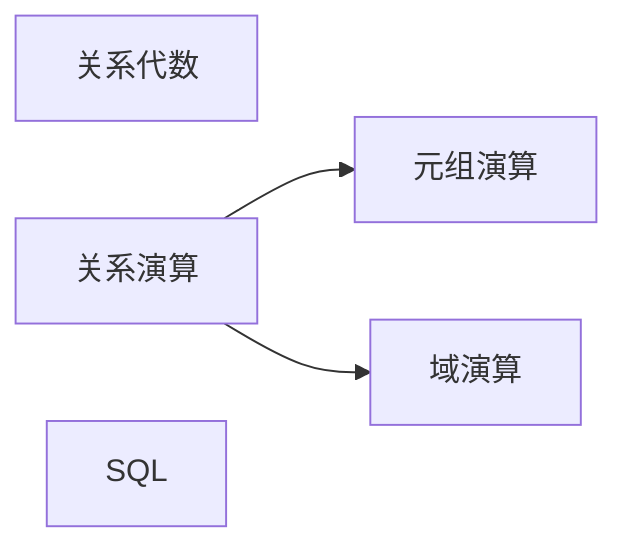

# 关系数据库

## 关系模型的数据结构

关系数据结构的特点：实体和联系都用关系（集合）这种单一的数据结构来实现

### 关系模型的数据操纵

关系操纵的特点：**操作对象和操作结果都是集合**，

关系的五种基本操作：

==**选择、投影、并、差、笛卡尔积**==

## 关系语言

**关系演算的特点：**

- 是高度非过程化的语言
- 是完备的
- 三种语言在表达能力上完全等价

## 关系代数

关系代数以集合为基础，定义一组运算，由已知关系经过一系列运算，得到需要的查询结果（新的关系）的表达方式

- 关系代数是==过程化==的查询语言
- **并、交、差 要求参与运算的两个关系必须具有相同的结构**

### 专门的关系运算

- **选择** $\sigma$

  > 在关系 R 中选择满足给定条件的元组 （行）

  $$
  \sigma_F(R) = \{t \in R\and F(t) = '真'\}
  $$

- **投影 $\pi$**

  > 从 R 中选择出若干属性列组成新的关系

  $$
  \pi_A(R) = \{t[A] | t\in R\}
  $$

  其中 A 是 R 中的属性列的集合

  - ==投影之后可能会**取消掉某些元组**（避免重复行）==
  - 投影操作是从 **列** 的角度进行运算

  例如：
  $$
  \pi_{Sname,Sdept}(Student)
  $$

- **连接**  $\Join$

  

  - 等值连接

  - 自然连接：一种特殊的等值连接，要求比较的分量必须是相同的属性组，**并在结果中把重复的属性列去掉**

    **不存在公共属性上值相等的元组会被舍弃**

  - 如果把要舍弃的元组也保留在结果关系中，在其他属性上填空值，这种连接叫 **外连接**

    - **保留哪一侧的元组，就叫什么外链接，比如：左外连接，保留左侧的所有元组**

- 象集

  在关系 R（X，Z）中，属性组 X 上值为 x 的诸元组在属性组 Z 上分量的集合

  

- 除法

  R（X,Y）/ S (Y,Z)

  即为：x * S(Y) 属于 R(Y)

  

  可以用于筛选有没有学生选了所有的课此类问题

  

  

  

