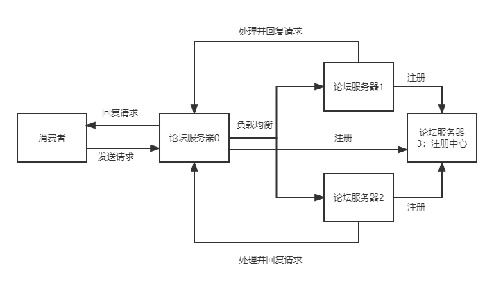
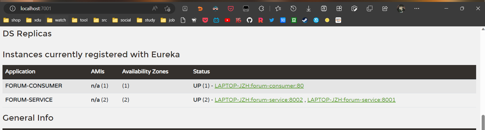
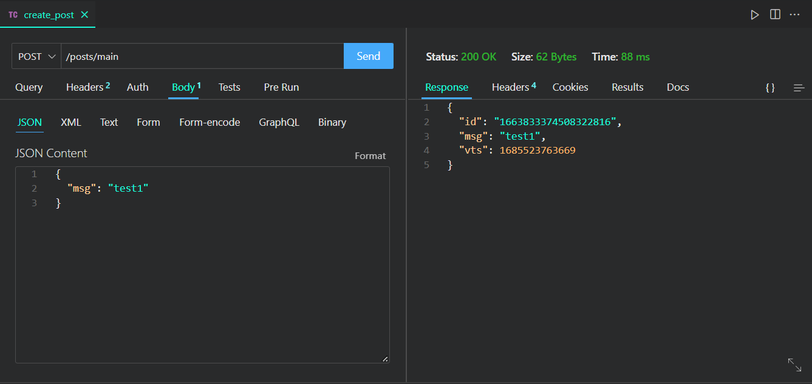
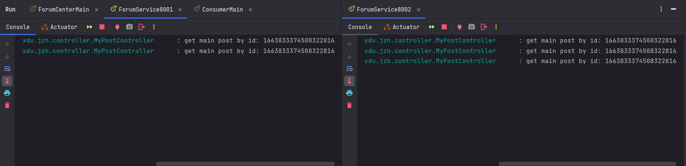
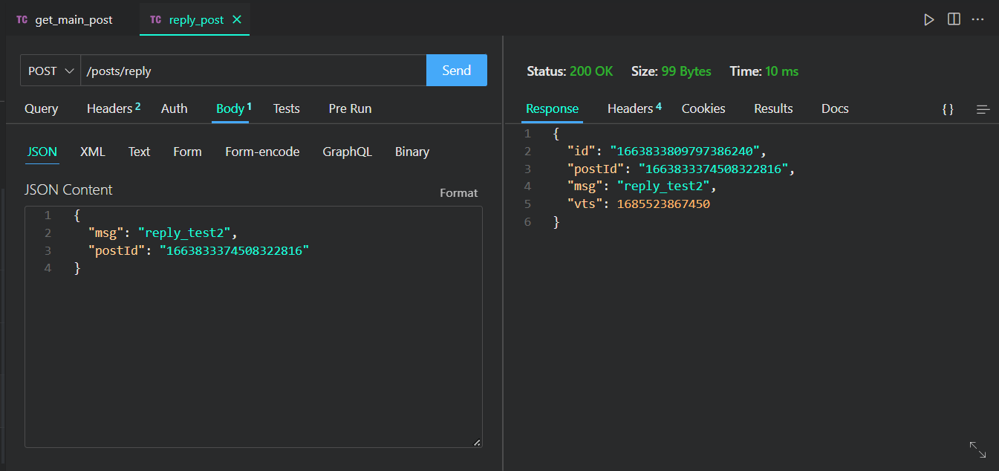

# 分布式论坛系统

- 学号：20009100359
- 姓名：江志航

## 功能要求

实现一个分布式论坛系统，包含多个副本论坛服务器。具体要求为：

1. 客户端软件可以选择连接任意的副本论坛服务器：发帖子（Post）、读帖子、针对某个帖子进行回应（Reply）。
2. 客户端软件显示论坛中的发帖和回应信息时要符合因果关系。
3. 假设模型：点对点拓扑；可靠FIFO链路；节点不会失效。

提示：

消息格式可以设计为 `<postid，replyid，msg，vts>`

- postid：该消息关联的主贴的全局唯一 ID 号；用雪花算法生成；
- replyid：该消息关联的回应的全局唯一 ID 号；用雪花算法生成
- msg：该消息的文本内容
- vts：该消息的逻辑时间戳（或向量时间戳）；

## 软件环境

- SpringCloud
- SpringBoot
- Eureka
- OpenFeign
- MySQL
- MybatisPlus
- Hutool

## 项目结构

一共 5 个模块，采用 maven 组织。

- forum-center：注册中心
- forum-common：公共类库
- forum-consumer：消费者入口服务
- forum-service-8001：论坛服务
- forum-service-8002：论坛服务

## 设计思想

### 分布式架构

如下是分布式论坛的整体架构图：

- 两台服务器用于处理实际请求，这里称为 A，B
- 一台服务器用于接收请求并通过负载均衡将请求转发到处理请求的服务器中进行处理，称为 C
- 一台服务器作为注册中心用于注册发现服务器，称为 D

由于机器资源有限，我采用了伪分布式的方法来模拟实际的分布式，A，B 服务实际分别运行在一台服务器上的 8001 和 8002 端口，C 服务运行在同一服务器上的 80 端口，而 D 服务则运行在同一台服务器上的 7001 端口。

### 分布式 ID 的生成

我使用雪花算法来生成分布式 ID，由于这里是伪分布式的形式，所以我手动在配置文件中指定了 A，B 这两台机器的机器 ID 和数据中心 ID，分别为 1，1 和 2，2，以便正确地生成分布式 ID。

这个 ID 作为每条消息的主键 ID。

## 编译运行说明

1. 首先编辑 forum-service-8001 和 forum-service-8001 中的配置文件 `src/main/resources/application.yaml`，配置好数据库条目；
2. 启动本地 MySQL 数据库服务，运行 `forum.sql` 初始化数据库；
3. 首先运行 forum-center 模块，开启注册中心；
4. 接着分别运行 forum-service-8001 和 forum-service-8002 模块；
5. 接着运行 forum-consumer 模块。

## 实验截图

访问 `localhost:7001`:

发现 3 个服务已经成功注册。

新建一个主贴：

通过返回的 ID 查看主贴：

多请求几次，查看后台：

发现负载均衡运行得不错。

进行回帖：

多发送几次，查看后台：

发现负载均衡运行得不错，各服务均能正常处理请求。

查看该主贴的所有回帖：

## 总结

通过分布式论坛的构建，我加深了对分布式系统的理解，对雪花算法在分布式系统中的应用有了更实际的理解。

同时，我对构建一个完整的微服务项目也有了更清晰的认识，对 maven 的构建过程，pom 依赖作用有了更深的理解。