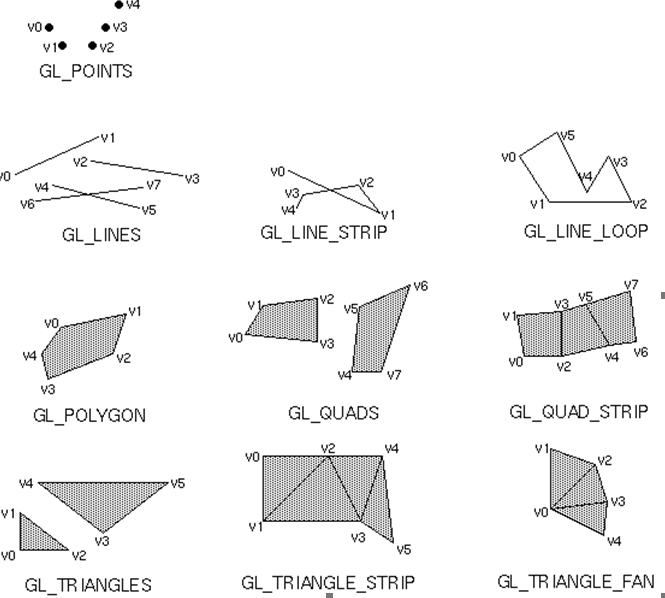
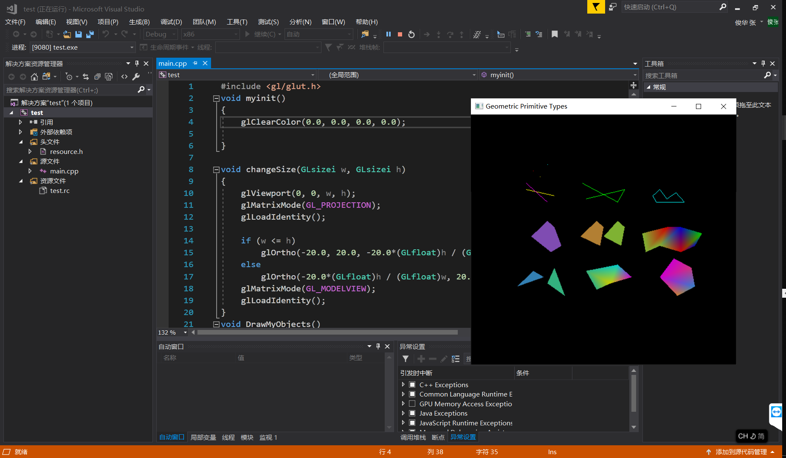
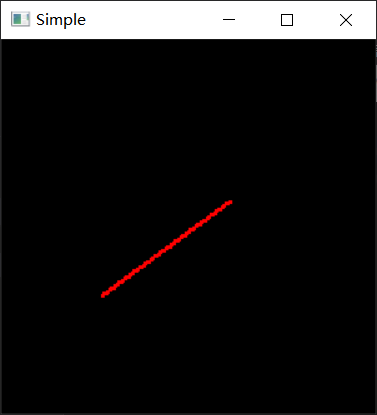
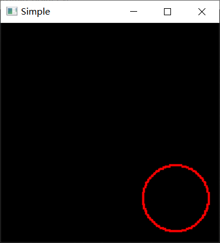
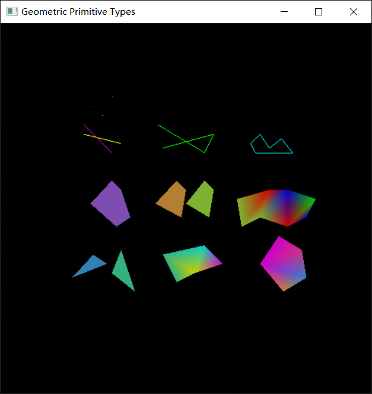

# 计算机图形学第一次上机实验

## 一、实验内容

**一、简单图元的绘制（借鉴lec3课件）**

1. 在屏幕上绘制几何图元（如下图所示），自定义坐标和颜色。

   

**二、算法模拟题（借鉴lec3课件，可二选一实现）**

1. **采用中点线算法在屏幕上画一条直线。**
2. **采用中点圆算法在屏幕上画一个圆。**

## 二、实验环境

Microsoft Visual Studio Community 2017 
VisualStudio.15.Release/15.8.6+28010.2041
Microsoft Visual C++ 2017
Windows10 SDK 10.0.17134.0

## 三、实验步骤

### 简单图元的绘制

本实验使用 Microsoft Visual Studio Community 2017 完成。

首先需要进行 glut 库的安装

- `glut32.dll` 该动态链接库需要复制到 `C:\Windows\SysWOW64` 目录下
- `glut.h` 头文件复制到 `Windows Kits\10\Include\10.0.17134.0\um\gl`目录下，其中 Windows Kits 为 Visual Studio 的 Windows SDK 的安装目录， `10.0.17134.0`为 SDK版本号
- `glut32.lib` 库文件复制到：`Windows Kits\10\Lib\10.0.17134.0\um\x86\`文件夹下

新建工程，导入图元绘制程序，

编辑项目属性，修改链接器附加依赖项：


编译链接运行，查看图元的绘制效果：



阅读程序代码，了解 OpenGL 编程的基本框架和使用 glut 库进行图元绘制的基本方法

### 算法模拟

1. 中点线算法的实现

   **基本原理：**

   > 在画直线段的过程中，当前像素点为 $（x_p ,y_p )$，下一个像素点有两种可选择点$P1(x_p +1,y_p )$或$P2(x_p +1,y_p +1)$。$M=(x_p +1,y_p +0.5)$为 $P1$ 与 $P2$ 之中点，Q为P理想直线与$x=x_p +1$垂线的交点。当M在Q的下方，则P2应为下一个像素点；M在Q的上方，应取P1为下一个像素点。

   将中点线算法采用增量计算，以提高计算效率：

   - 选择 $P1$ 时，M沿x方向上递增一步
     $$
     dnew=F(x_p+2,y_p+1/2)\\
     dold=F(x_p+1,y_p+1/2)
     $$
     所以 $dnew=dold+dy$

   - 选择 $P2$ 时，M沿x和y方向上都递增一步

   $$
   dnew=F(x_p+2,y_p+3/2)\\
   dold=F(x_p+1,y_p+1/2)
   $$

     所以 $dnew=dold+dy-dx$

      d的初始值：$dstart=F(x_0+1,y_0+1/2)=dy-dx/2$

   使用 `glut` 库的 `glVertex2i` 函数对直线进行逐图像点绘制，函数原型为：

   ```c++
   void glVertex2i( GLint x, GLint y )
   ```

   `glVertex` 命令需要在 `glBegin` / `glEnd`函数对中进行调用。使用 `glvertex` 命令画单独的像素点，需要调用：`glBegin(GL_POINTS);` 函数。

   由于 glut 库默认画出的像素点大小过小，会出现线段不连续的现象，因此在这里手动调整像素点的大小

   ```c++
   glPointSize(3.0);
   ```

   中点线算法的 C++ 语言实现如下：

   ```c++
   void MidPointLine(GLint x0, GLint y0, GLint x1, GLint y1, Color color) {
   	int dx, dy, incrE, incrNE, d, x, y;
   	dx = x1 - x0;
   	dy = y1 - y0;
   	x = x0;
   	y = y0;
   	glPointSize(3.0);
   	glBegin(GL_POINTS);
   	glColor3f(color.r, color.g, color.b);
   	glVertex2i(x, y);
       if (x0 > x1)	return MidPointLine(x1, y1, x0, y0, color);
       d = dx - 2 * dy;
       incrE = -2 * dy;
       incrNE = 2 * (dx - dy);
       while (x < x1) {
           if (d > 0)	d += incrE;
           else {
               d += incrNE;
               y++;
           }
           x++;
           glVertex2i(x, y);
       }
       glEnd();
   }
   ```


   该函数接受四个整型参数，分别是起点与终点的x和 y 坐标，由于函数只接受整型参数，这里注册 `changeSize` 函数，绘制窗口时调整窗口坐标范围为 -100<x<100 , -100<y<100

   ```c++
   void changeSize(GLsizei w, GLsizei h)
   {
   	GLfloat aspectRatio;
   	glViewport(0, 0, w, h);
   	glMatrixMode(GL_PROJECTION);
   	glLoadIdentity();
   	aspectRatio = (GLfloat)w / (GLfloat)h;
   	if (w <= h)
   		glOrtho(-100.0, 100.0, -100.0 / aspectRatio, 100.0 / aspectRatio, 1.0, -1.0);
   	else
   		glOrtho(-100.0*aspectRatio, 100.0*aspectRatio, -100.0, 100.0, 1.0, -1.0);
   	glMatrixMode(GL_MODELVIEW);
   	glLoadIdentity();
   }
   ```

   调用该算法绘制一条 0<k<1 的直线如下：

   

   通过对不同斜率直线的分类讨论，可推出其他斜率情况下的增量递推表达式，按照公式补充完善算法，以处理所有的直线斜率情况。(见附注完整代码)

   - 为算法增加颜色设置：

     定义结构体：

     ```c++
     struct Color
     {
     	double r;
     	double g;
     	double b;
     };
     ```

     在点亮像素前通过 `glColor3f()` 函数修改笔触颜色：

     ```c++
     glColor3f(color.r, color.g, color.b);
     ```


1. 中点圆算法的实现

   中点圆算法的基本原理与中点线算法类似，通过判断中点在圆内还是圆外，点亮对应的像素点。同样地，采用增量算法以提高算法执行效率。

   可以只计算圆心为坐标原点的圆的像素位置，其他位置的圆通过圆心的偏移量经过位移变换得出。

   该算法的 C++ 实现如下：

   ```c++
   void MidpointCircle(GLint radius, GLint xc, GLint yc)
   {
   	GLint x, y, d;
   	x = 0, y = radius, d = 1 - radius;
   	glPointSize(3.0);
   	glBegin(GL_POINTS);
   	glColor3f(1.0, 0.0, 0.0);
   	glVertex2i(xc, yc + y);
   	while (y > x)
   	{
   		if (d < 0)//此时在第二个八分圆处，中点在圆内，选上方的点 
   		{
   			d += x * 2 + 3;
   			x++;
   		}
   		else
   		{
   			d += (x - y) * 2 + 5;
   			x++; y--;
   		}
   		glVertex2i(xc + x, yc + y);
   		glVertex2i(xc - x, yc + y);
   		glVertex2i(xc + x, yc - y);
   		glVertex2i(xc - x, yc - y);
   		glVertex2i(xc + y, yc + x);
   		glVertex2i(xc - y, yc + x);
   		glVertex2i(xc + y, yc - x);
   		glVertex2i(xc - y, yc - x);
   	}
   	glEnd();
   }
   ```

   可以只对第二个八分圆上的点按照中点圆算法进行绘制，圆的其他部位依照圆的对称性通过坐标变换可以计算得出。

   调用该算法绘制圆如下：

   


## 四、实验结果

调用 glut 库实现简单图元的绘制如下：



编写`RenderScene()` 函数对算法实现功能进行测试：

```
void RenderScene()
{
	Color RED{ 1.0,0,0 };
	Color BLUE{ 0,0,1.0 };
	glClear(GL_COLOR_BUFFER_BIT);//用当前清除颜色清除窗口
	
	MidPointLine(-60, 70, -15, 77,RED);
	MidPointLine(-15, 77, -20, 35, RED);
	MidPointLine(-20, 35, -65, 23, RED);
	MidPointLine(-65, 23, -75, -20, RED);
	MidPointLine(-75, -20, -17, -7, RED);
	MidPointLine(-17, -7, -23, -79, RED);
	MidPointLine(-23, -79, -45, -70, RED);
	MidPointLine(46, 77, 22, 13, RED);
	MidPointLine(-3, -2, 64, 5, RED);
	MidPointLine(12, 80, 10, -74, RED);
	MidPointLine(13, -3, 79, -56, RED);
	MidPointLine(8, -76, 38, -60, RED);
	MidpointCircle(90, 0, 0, RED);
	MidpointCircle(15, 60, -60, BLUE);
	
	glFlush();//刷新绘图命令
}
```

测试实验结果如下：


可见，本实验实现的算法对不同斜率的直线和不同大小的圆都能较好完成绘制

## 五、实验心得体会

通过本次实验，我掌握了 Windows 操作系统下 OpenGL 编程环境和 glut 库的安装配置方法。了解了使用 glut 库进行简单图元绘制的一般过程。通过自己亲自编写实现中点线、中点圆算法，对这些算法的基本原理和具体实现细节有了更加深刻的印象和体会，使我受益匪浅。

