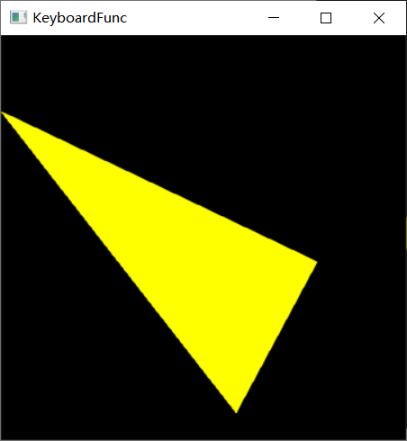

# 计算机图形学第二次上机实验

## 一、实验内容

**一、 图形变换（借鉴lec4课件）**

1. 利用OpenGL实现一个立方体关于参考点（10.0,20.0,10.0）进行放缩变换，放缩因子为（2.0,1.0,0.5）。
2. 利用OpenGL实现一个矩形关于 $y=x+5$ 对称的新图形。
3. 通过定义键盘回调函数，每按一次空格键，让三个点依次完成画点、画线、画三角形、让三角形平移和缩放，并让三角形沿三角形中心旋转起来。

## 二、实验环境

Microsoft Visual Studio Community 2017 
VisualStudio.15.Release/15.8.6+28010.2041
Microsoft Visual C++ 2017
Windows10 SDK 10.0.17134.0

## 三、实验步骤

### 立方体的放缩变换

#### 编写 changeSize() 回调函数

由于本实验绘制了三维场景，故需要 `gluPerspective()`  这个函数设置三维透视投影矩阵，在执行命令 `glMatrixMode(GL_PROJECTION)` 和 `glLoadidentity()` 之后使用；它指定了观察的视景体在世界坐标系中的具体大小，其中的参数 `aspect` 应该与窗口的宽高比大小相同。这样显示出的物体才不会被扭曲。

由 `gluPerspective()` 产生的矩阵是当前矩阵与指定的矩阵相乘得到的，就好像是调用 `glMatrix()  `产生的矩阵一样。为了使透视矩阵替代当前矩阵，在调用 `gluPerspective()` 之前要先调用 `glLoadidentity()` 这个函数，把当前矩阵重置为单位矩阵。

最终代码如下：

```c++
void ChangeSize(GLsizei w, GLsizei h)
{
	GLfloat aspectRatio;
	if (h == 0)
		h = 1;
	glViewport(0, 0, w, h);
	glMatrixMode(GL_PROJECTION);
	glLoadIdentity();

	aspectRatio = (GLfloat)w / (GLfloat)h;
	gluPerspective(60, aspectRatio, 10, 60);
	glMatrixMode(GL_MODELVIEW);
	glLoadIdentity();
}
```

------------

#### 编写 RenderScene() 函数进行场景渲染

首先需要绘制一个立方体，绘制立方体，可以通过调用 glut 库的 `glutWireCube` 函数实现：

```
glColor3f(1.0, 0.0, 0.0);
glutWireCube(10.0);
```

执行这两条语句，以原点为中心，绘制一个边长为 10 的立方体。接下来需要对立方体关于参考点（10.0,20.0,10.0）进行放缩变换，放缩因子为（2.0,1.0,0.5）

由于模型和视图的变换都通过矩阵运算来实现，在进行变换前，应先设置当前操作的矩阵为“模型视图矩阵”。设置的方法是以 `GL_MODELVIEW` 为参数调用 `glMatrixMode` 函数：

```
glMatrixMode(GL_MODELVIEW);
```

需要在进行变换前把当前矩阵设置为单位矩阵

```
glLoadIdentity();
```

之后将世界坐标原点移动到放缩参考点，然后按比例缩放

```
glTranslatef(10.0, 20.0, 10.0); 
glScalef(2.0, 1.0, 0.5);  
```

完成缩放之后，将坐标原点移动回初始位置：

```
glTranslatef(-10.0, -20.0, -10.0); 
```

最后使用 `glutWireCube` 函数，绘制放缩之后的立方体：

```
glColor3f(0.0, 1.0, 0.0);
glutWireCube(10.0);
glFlush();
```

----------

#### 注册键鼠操作回调函数，实现运行时动态视角变换

通过鼠标键盘在执行时动态调整视角，获得更好的结果预览体验，视角变换通过 gluLookAt() 函数，完成从世界坐标系到眼坐标系的转换，通过注册 

```
glutMouseFunc(MouseFunc);
glutMotionFunc(MouseMotion);
```

**按住鼠标右键可以上下左右旋转视角。按住鼠标左键并前后移动可以放大或缩小视景。具体函数实现见附录完整代码。**


### 矩形关于直线对称

本实验不使用 OpenGL 內建的模型视图矩阵运算实现，而是自己进行矩阵运算，得出变换矩阵，使用该矩阵与原始矩形坐标点相乘，得到变换后的新坐标，完成对称图形的绘制。

由于要进行二维平面上的图形变换，因此需要使用三维齐次坐标变换矩阵进行运算。定义三维矩阵数据类型：

```c++
typedef GLfloat martix33[3][3];
```

定义三维矩阵乘法运算：

```c++
void martixmulti(martix33 &m1, martix33 &m2) {
	double mt[3][3] = { 0 };
	for (int i = 0; i < 3; i++) {
		for (int j = 0; j < 3; j++) {
			mt[i][j] = m1[i][0] * m2[0][j] + m1[i][1] * m2[1][j] + m1[i][2] * m2[2][j];
		}
	}

	for (int i = 0; i < 3; i++) {
		for (int j = 0; j < 3; j++) {
			MARTIX[i][j] = mt[i][j];
		}
	}
}
```

只需要将每次变换的矩阵，逐次相乘，就可得到最终的变换矩阵

```c++
martix33 move1 = { {1,0,5},{0,1,0},{0,0,1} };
martix33 rotat1 = { {0.7071,-0.7071,0},{0.7071,0.7071,0},{0,0,1} };
martix33 scale = { {-1,0,0},{0,1,0},{0,0,1} };
martix33 rotat2 = { {0.7071,0.7071,0},{-0.7071,0.7071,0},{0,0,1} };
martix33 move2 = { {1,0,-5},{0,1,0},{0,0,1} };

martixmulti(move1, MARTIX);
martixmulti(rotat1, MARTIX);
martixmulti(scale, MARTIX);
martixmulti(rotat2, MARTIX);
martixmulti(move2, MARTIX);
```

该矩阵再和原始矩形的齐次坐标点乘，结果即为经过变换之后新的坐标。无需修改模型视图矩阵，以新的坐标为参数绘制矩形，得到的就是按照给定直线对称变换之后的图形


完整代码实现见附录。

### 键盘回调函数与动画

#### 绘图模式切换

该实验需要实现按空格键进行绘制模式切换和场景重绘。因此，需要注册键盘回调函数，当捕获到空格输入时，修改全局变量 `currentMode` 的值，并调用重绘函数 `glutPostRedisplay` 重新渲染，实现模式切换。

#### 图形变换动画

要实现动画效果绘制，其实现方式之一是每次绘制时进行小幅度变换，并通过高速调用重绘函数，实现动画效果。

这里，我采用注册时钟回调函数，实现高速重绘

```c++
void timer(int value)
{
	if (currentMode > 3)
	{
		time += 1;
	}
	time = time % 360;
	glutTimerFunc(16, timer, 0);
	glutPostRedisplay();
}
```

该函数检测到模式编号大于 3 时，就对计时器 `time` 进行增一操作，调用 `glutPostRedisplay()` 函数重绘。 并在16毫秒之后重启时钟回调函数，进行下一帧图形的绘制。

在动画模式下，绘制函数通过对 `time` 中保存的数值，叠加微小变换，确定图形变换状态，修改模型视图矩阵，达到图形变换效果。

```
case 4:
    glLoadIdentity();
    glTranslatef(0.01*time, 0.01*time, 0);
    glBegin(GL_TRIANGLES);
case 5:
    glLoadIdentity();
    glScalef(1+0.02*time, 1-0.01*time, 0);
    glBegin(GL_TRIANGLES);
```

为了让动画更流畅播放，需要修改 GLUT 显示模式，使用双缓冲区快速交换完成逐帧绘制

```
glutInitDisplayMode(GLUT_DOUBLE | GLUT_RGB);
```

##### 三角形绕中心旋转

绕中心旋转，需要确定旋转中心，旋转中心 x 坐标为三个点 x 坐标的平均值，Y 坐标为三个点 y 坐标的平均值。

之后，需要修改模型视图矩阵，将原点移动到旋转中心，旋转完成之后，重新平移原点到原始位置。

```
case 6:
		glLoadIdentity();
		glTranslatef(centx(X1, Y1, X2, Y2, X3, Y3), centy(X1, Y1, X2, Y2, X3, Y3), 0);
		glRotatef(1*time,0,0,1);
		glTranslatef(-centx(X1, Y1, X2, Y2, X3, Y3), -centy(X1, Y1, X2, Y2, X3, Y3), 0);
		glBegin(GL_TRIANGLES);
	}
	glVertex2f(X1, Y1);
	glVertex2f(X2, Y2);
	glVertex2f(X3, Y3);
	glEnd();
	glutSwapBuffers();
```





## 五、实验心得体会

通过本次实验，我掌握了 OpenGL 实现二维三维图形变换的基本方法，了解了內建的模型视图矩阵运算的基本原理和过程。在此基础上自己定义了变换矩阵，实现了二维图形变换。并使用键盘、鼠标回调函数，实现了与绘制场景的基本交互。使我对课程所学知识有了更深刻的了解和印象，进一步增强了我的编程能力。

